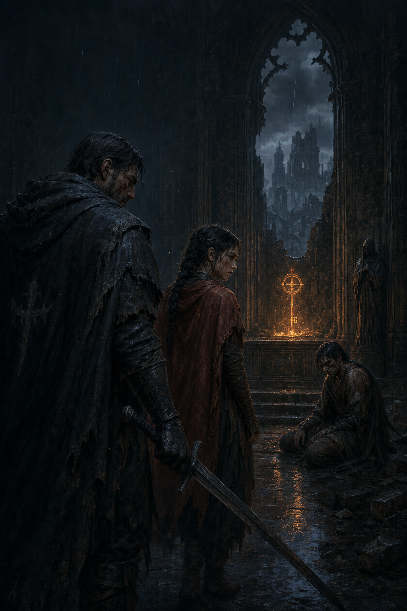

# Worlds — Run the Story

Worlds is an audio-first running game where the runner becomes a character inside a premium authored adventure. Direction, pace, distance, and stops are the controls: turn left to take one path, speed up to escape, slow down to move quietly, or stop to uncover something the story would otherwise leave behind.

> The world is authored. The experience is adaptive.

Unlike a linear audiobook that happens to play during a run, Worlds treats real-world movement as story input. An AI game director preserves the writer's characters, lore, and major plot beats while choosing compatible scenes, reacting to performance, carrying consequences forward, and shaping the experience to the length and rhythm of the run.



## The hackathon demo

The current playable world is **Greywatch: Blood in the Chapel**, a dark fantasy mystery built to demonstrate the complete interaction loop:

1. A cinematic scene begins with expressive character voices, music, and sound effects.
2. The story presents a decision in-world rather than as a conventional menu.
3. The runner responds through direction, pace, stopping, or speech.
4. The route and characters react immediately.
5. Success and failure create different story consequences.
6. The run ends with a recap of the path the runner actually took.

The authored Greywatch graph contains 15 story nodes and 171 prerecorded dialogue and sound-effect assets. After the fourth authored decision, the backend can move the run into a short freestyle continuation: Gemini selects the next compatible beat, writes state-aware reactions within the approved world, and assigns character emotion; ElevenLabs renders those lines with the established voices.

If either external service is unavailable, authored story and caption fallbacks keep the core demo playable rather than leaving the run hanging.

## How movement controls the story

| Runner input | Story meaning |
| --- | --- |
| Turn left or right | Choose a route or approach |
| Speed up or hold pace | Escape, pursue, cross, or endure |
| Slow down | Hide, investigate, or move carefully |
| Stop or continue | Discover an optional moment or press onward |
| Speak a response | Resolve a constrained in-world decision |

The mobile build currently includes simulator controls for direction, pace, and stop decisions so the full narrative can be demonstrated indoors. Vocal decisions use the device's native speech recognizer. Only transcript text is sent to Gemini; recordings are not uploaded to the model.

## Project structure

| Path | Purpose |
| --- | --- |
| `mobile/` | Expo/React Native runner experience, active-run UI, and recap |
| `backend/` | Current Greywatch graph, run state, movement resolution, Gemini direction, and ElevenLabs audio |
| `story-audio/greywatch/` | The complete prerecorded Greywatch voice and SFX library plus manifests |
| `story-paths.html` | Standalone story-tree and audio review tool |
| `demo/` | Vite/React browser prototype |
| `server/` | Earlier adaptive-story backend retained as a reference implementation |
| `output/` | Worlds UI and brand direction in PDF and editable DOCX formats |
| `tools/` | Scripts used to build and inspect the design reference |

## Run locally

### Prerequisites

- Node.js and npm
- Expo development tooling for the mobile app
- A Gemini API key for live text classification and freestyle direction
- An ElevenLabs API key and voice IDs for live generated dialogue

Install the root workspaces and the mobile app dependencies:

```bash
npm install
npm --prefix mobile install
```

Copy the environment template and add any live-service credentials:

```bash
cp .env.example .env
```

Start the current backend on port `3002`:

```bash
npm run backend
```

In a second terminal, start Expo:

```bash
npm run mobile
```

Speech recognition relies on a native module, so vocal decisions require an Expo development build rather than Expo Go. When using a physical phone, set `EXPO_PUBLIC_BACKEND_URL` to the computer's LAN address before starting Expo, for example `http://192.168.1.20:3002`.

## Review the authored story and sounds

Open `story-paths.html` from the repository root through a local static server so its relative audio paths resolve correctly:

```bash
npx serve .
```

The page visualizes the Greywatch branching structure and can play individual lines or a complete selected scene from `story-audio/greywatch/manifest.js`.

## Verify the project

```bash
npm run build:backend
npm run test:backend
npm run check:mobile
npm run build:server
npm test
npm run build --workspace=demo
```

The legacy server can still be started on port `3001` with `npm run server`.

## Product direction

Worlds is built around premium authored story worlds rather than unlimited freeform generation. Writers and partners define the canon, characters, tone, major consequences, climax, and ending space. The AI acts as a live director inside those boundaries, adapting pacing, reactions, transitions, and callbacks to the runner's exact journey.

The long-term platform vision includes original campaigns, creator collaborations, licensed worlds, and persistent stories that continue across runs of different lengths.

**Worlds is not a story you listen to while running. It is a story you run.**
